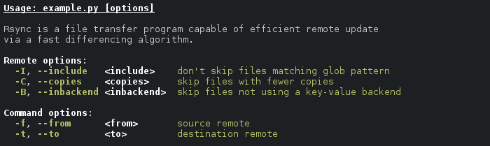

Introduction
============

This module provides two help formatters for optparse_. They provide
terser and more customizable option formatting in comparison to the
default help formatter.

A CLI (see `example.py`_) using the default
``optparse.IndentedHelpFormatter`` looks like:

Not bad, but the verbose ``$short $metavar, $long=$metavar`` format
causes excessive word wrap, which in turn makes the usage a little
hard to skim through.

The same CLI with ``optparse_mooi.CompactHelpFormatter``:

Or with the colorizing version of the compact formatter -
``optparse_mooi.CompactColorHelpFormatter``:

Installation
============

The latest stable version of optparse-pretty is available on pypi,
while the development version can be installed from github:

.. code-block:: bash

    # latest stable version
    $ pip install optparse-pretty

    # latest development version
    $ pip install git+git://github.com/gvalkov/optparse-pretty.git

Alternatively, you can just copy the `optparse_mooi.py`_ module to
your project:

.. code-block:: bash

    $ wget https://raw.githubusercontent.com/gvalkov/optparse-pretty/master/optparse_mooi.py

Usage
=====

The most basic use case is::

    from optparse import OptionParser
    from optparse_mooi import CompactHelpFormatter, CompactColorHelpFormatter

    parser = OptionParser(formatter=CompactHelpFormatter())
    parser = OptionParser(formatter=CompactColorHelpFormatter())

The help formatters take the following keyword arguments. The defaults
are::

    CompactHelpFormatter(
        metavar_format = ' <{}>',
        metavar_column = None,
        option_separator = ', ',
        align_long_opts = False,
        help_string_formatter = None,
        preformatted_description = True,
        preformatted_epilog = True
    )

    CompactColorHelpFormatter(
        heading_color = 'white-bold',
        usage_color = 'white-bold',
        shopt_color = None,
        lopt_color = None,
        description_color = None,
        epilog_color = None,
        metavar_color = None,
        help_color = None,
        option_colormap = None
    )

``CompactColorHelpFormatter`` also accepts all of
``CompactHelpFormatter``'s arguments.

Several examples that demonstrate the effects of various options:

**metavar_format**::

  >>> HelpFormatter()
  -x EXCLUDE, --exclude=EXCLUDE  skip files matching glob pattern

  >>> CompactHelpFormatter(metavar_format=' ${}')
  -x, --exclude $exclude         skip files matching glob pattern

  >>> fmt = lambda opt: ' ' + str.upper(opt.metavar or opt.dest)
  >>> CompactHelpFormatter(metavar_format=fmt)
  -x, --exclude EXCLUDE          skip files matching glob pattern

**metavar_column**::

  >>> CompactHelpFormatter()
  -I, --include <include>      don't skip files matching glob pattern
  -C, --copies <copies>        skip files with fewer copies
  -B, --inbackend <inbackend>  skip files not using a key-value backend

  >>> CompactHelpFormatter(metavar_column=17)
  -I, --include   <include>    don't skip files matching glob pattern
  -C, --copies    <copies>     skip files with fewer copies
  -B, --inbackend <inbackend>  skip files not using a key-value backend

**option_separator**::

  >>> CompactHelpFormatter()
  -I, --include <include>      don't skip files matching glob pattern

  >>> CompactHelpFormatter(option_separator='|')
  -I|--include <include>      don't skip files matching glob pattern

**align_long_opts**::

  >>> CompactHelpFormatter()
  -n, --numcopies <numcopies>  override default number of copies
  --trust <trust>              override trust setting
  --semitrust <semitrust>      override trust setting back to default
  --untrust <untrust>          override trust setting to untrusted
  -i, --in <in>                skip files not present in remote

  >>> CompactHelpFormatter(align_long_opts=True, metavar_column=17)
  -n, --numcopies <numcopies>  override default number of copies
      --trust     <trust>      override trust setting
      --semitrust <semitrust>  override trust setting back to default
      --untrust   <untrust>    override trust setting to untrusted
  -i, --in        <in>         skip files not present in remote

Using the colorizing version of ``CompactHelpFormatter``:

::

    CompactColorHelpFormatter(
        heading_color = 'white-bold',
        usage_color   = 'white-bold-underline',
        shopt_color   = 'green-bold',
        lopt_color    = 'green-bold',
        metavar_color = 'white-bold',
        help_color    = 'green',
        description_color = 'white'
    )

::

   CompactColorHelpFormatter(
        option_colormap = {
           ... # same options as above
           '-B':           ('white', 'white-bold',  'green-bold', 'red-bold'),
           ('-f', '--to'): ('red-bold', 'red', 'white', 'blue-bold'),
    })

Keys are short or long opts, or a list of short or long opts. Values
specify the color to be applied to the short flag, long flag, metavar
and help message, in that order. Each of these can be ``None`` or a
color specifier (e.g. ``"white-bold-underline"``)

Please refer to the module's docstrings for more usage information.

Note that ``CompactColorHelpFormatter`` is not very robust (it would
be immeditiately evident if you had a look at its implementation). It
also works only on ANSI capable terminals.

Isn't optparse obsolete?
========================

Even though optparse_ is no longer developed and has less features
than argparse_, it is perfectly usable and quite practical. Some
arguments for not feeling bad about still using it:

 - It's simpler and shorter than argparse (1.7k vs 2.4k sloc).

 - It's easier to customize. I've tried writing similar help
   formatters for argparse and it was considerably less straightforward.

 - Optparse has been in the STL since version 2.3 - argparse since 3.2.

If you don't happen to need any of argparse's great features, optparse
is a fine alternative (and so is getopt_, if you need even less
features).

License
=======

This module is released under the terms of the `Revised BSD License`_.

.. _`Revised BSD License`: https://raw.github.com/gvalkov/optparse-pretty/master/LICENSE
.. _optparse:              https://docs.python.org/3.4/library/optparse.html
.. _argparse:              https://docs.python.org/3.4/library/argparse.html
.. _`optparse_mooi.py`:    https://raw.githubusercontent.com/gvalkov/optparse-pretty/master/optparse_mooi.py
.. _`example.py`:          https://github.com/gvalkov/optparse-pretty/blob/master/example.py
.. _getopt:                https://docs.python.org/3.4/library/getopt.html
